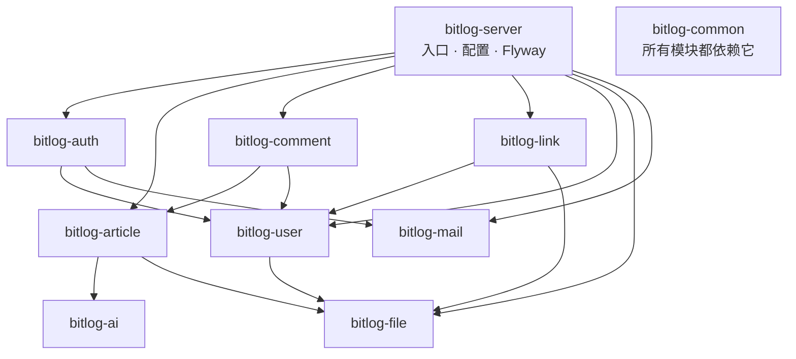

# 架构说明

这份文档记录 BitLog 的结构和它背后的取舍：为什么这么选、放弃了什么、代价在哪。实现细节以代码
为准，这里只写代码本身讲不清楚的部分。

## 全景

仓库里是两个独立部署的东西：

- **`bitlog-backend/`**：Spring Boot 应用，打成一个 JAR、一个镜像，提供全部 API
- **`bitlog-frontend/`**：Vue 3 应用，构建成静态站点，部署在 Cloudflare Pages

前端在构建期就把首页、文章列表和文章正文预渲染进 HTML，这部分内容的读取不经过后端，后端挂掉
也照常能看。其余请求仍然回源：登录、评论、后台，以及友链页的列表（它在组件挂载后才取数）。

## 后端：模块化单体

### 为什么不是微服务

这是一个单人维护、日活很小的博客。微服务能买到的独立部署、独立扩容、故障隔离，在这个规模下
都用不上，而它索要的代价，也就是分布式事务、服务发现、跨服务调试和多套部署流水线，要立刻付清。

但"不拆服务"不等于"不划边界"。业务边界模糊的代价是渐进的：今天多一个跨模块的直接调用，一年后
就没人说得清改一张表会波及什么。所以这里选的是模块化单体：**边界用 Maven 模块切开，部署仍然是
一个进程**。模块之间只能看见对方 pom 里声明过的依赖，依赖关系是显式的，哪天某个模块真要独立
部署，也知道要拆什么。

### 模块与依赖

| 模块 | 职责 |
| --- | --- |
| `bitlog-common` | 统一响应与分页、安全配置、上下文、异常处理等公共基础设施 |
| `bitlog-user` | 用户账号、资料、后台用户查询 |
| `bitlog-auth` | 注册登录、令牌、验证码、OAuth 身份与凭据 |
| `bitlog-article` | 文章、版本、分类、标签 |
| `bitlog-comment` | 评论与回复 |
| `bitlog-file` | 基于 S3 / MinIO 的上传与地址转换 |
| `bitlog-link` | 友链申请、审核、展示 |
| `bitlog-ai` | 大模型配置与调用 |
| `bitlog-mail` | 基于 Resend 的邮件发送，不含任何业务模板 |
| `bitlog-server` | 应用入口、运行配置、Flyway 迁移 |

依赖是单向的，没有环。`common` 只放真正与业务无关的东西，一旦某个业务概念沉到 `common`，
所有模块就都能碰它，边界也就废了。

### port 边界

被依赖的模块对外暴露一个 `port` 包（`UserPort`、`ArticlePort`、`AiChatPort`），跨模块调用走它，
而不是直接注入对方的 Service 或 Mapper。`port` 是模块对外承诺的全部，其余实现都是模块内部的事。

代价是真实的：加一个跨模块查询要先在 port 上开口子，比直接注入 Service 麻烦。换来的是改模块内部
实现时，影响范围有个明确的边界。

**这条约定目前只做到一半。** 新代码按它写，但仓库里还有先于 port 存在的直接注入没有收口，例如
`AuthServiceImpl` 直接注入了 `UserAccountService`，`FriendLinkServiceImpl` 直接注入了
`FileService`。同一个类里 `UserPort` 和跨模块 Service 并存的情况也有。而且没有任何编译期或
构建期检查来拦住这种写法，靠的是评审时人去看。把存量收口、并加上一层架构测试来固化，是待办
事项，不是已经完成的状态。

### 分层

模块内部保持 `Controller -> Service -> DAO/Mapper`。事务边界统一放在 Service 层，复杂查询写在
MyBatis XML Mapper 里而不是拼在 Java 代码中。DO / DTO / VO / Param 各司其职，转换由 MapStruct
生成，不手写映射代码。

## 数据

PostgreSQL，结构变更全部走 Flyway 迁移（`bitlog-server/src/main/resources/db/migration`），应用
启动时自动执行。生产环境禁用 `flyway.clean`。

几处值得说明的设计：

- **`article_version`**：文章内容与文章元数据分表。草稿和已发布内容是同一篇文章的不同版本，
  发布不是覆盖写，历史版本可以回溯。
- **`user_identity`**：第三方登录身份独立成表，而不是往 `user_account` 上加 `google_id` 这类列。
  加一种登录方式是插一行，不是改表结构；一个账号也可以同时绑定多种登录方式。
- **软删除的唯一索引**：`user_account` 的用户名和邮箱唯一索引都带 `WHERE deleted = 0` 条件。
  这样已注销账号的用户名和邮箱退出唯一性判定，可以被后来者重新使用，同时原始值原样保留供审计。

## 认证与授权

JWT 双令牌：access token 15 分钟，refresh token 30 天。令牌里带权限串（形如 `["ROLE_ADMIN"]`），
所以直接改数据库里的角色不会立即生效，要重新登录换一个令牌。

授权白名单有一处刻意的写法值得记一笔：`security.additional-whitelist` 里的通配符用单星而不是
双星，因为单星只匹配一层路径段。这让 `/article/{id}/publish`、`/article/{id}/comments` 这类写
接口落在白名单之外，由过滤器强制校验 JWT，`@RequiresAdmin` 之类的注解只作为第二道防线。改成
双星，这些写接口就只剩注解一层保护了。

## 前端

### 为什么是 SSG

博客是典型的读多写少：内容更新频率以天计，读取频率以秒计。SSR 为每次读取付出服务端渲染成本，
SPA 把首屏和 SEO 让给了客户端 JS，两者的代价都落在最高频的路径上。SSG 把渲染成本一次性付在
构建期，读取时就是 CDN 上的静态文件，后端不参与，也没有冷启动。

代价是发布不再是即时的：文章发布后需要触发一次重建。后端的发布钩子负责这件事。

### 构建期硬校验

预渲染需要在构建时访问后端 API 取数。这里有个安静的失败模式：API 不可用时，vite-ssg 依然会输出
结构完整但内容为空的 HTML，构建显示成功，部署上去却是一批标题全叫 BitLog 的空壳页。而发布钩子
触发的重建，恰好可能撞上后端重启的时机。

所以 `postbuild` 阶段有一个硬校验脚本（`scripts/verify-ssg.mjs`），检查产物里确实带上了内容和
SEO 元数据，不达标就让构建失败。宁可构建红，不要静默发布空站点。

这也是 CI 用 `npm run build:ci` 而不是 `npm run build` 的原因：CI 环境不该依赖生产 API 的可用性，
所以走一个不触发 `prebuild` / `postbuild` 钩子的脚本名，只做类型检查和 SSG 编译。

### 共享编辑器包

`packages/editor` 被 Web 端和桌面端同时依赖，里面是 Markdown 编辑器和内容渲染样式。

动机是一个具体的坑：编辑时看到的效果和文章页看到的效果，如果由两份实现分别负责，就一定会漂移，
而且是慢慢漂移到某天有人发现代码块的行高对不上。共用一份实现让"所见即所得"这件事有结构上的保证，
而不是靠两边同步维护样式。

## AI 能力路由

配置不是按"模型"组织的，而是按**能力**：`bitlog.ai.capabilities.text-json` 声明需要一个能返回
JSON 的文本能力，再指向具体的 provider 和 model。调用方要的是"帮我把这段文本结构化"，不是
"帮我调用 qwen3.6-flash"。

换模型、换供应商，改的是配置里的一行映射，业务代码不动。

## 已知的取舍与未完成的部分

- **环境变量全部必填**：目前缺任何一项配置（含 AI、邮件、OAuth）都会导致启动失败并指明缺哪一项。
  好处是不会带着半残的配置跑起来，坏处是想本地跑一下的人也得先备齐三家外部服务的密钥。
- **AI 配置目前也是必填**：能力路由让换模型变成改一行配置，但缺少 `QWEN_API_KEY` 仍会导致启动
  失败，AI 能力还没有做成缺配置即降级。
- **前端没有自动化测试**：靠 ESLint、类型检查和构建期校验兜底。
- **部署配置不在这个仓库**：Compose 编排和运维手册涉及主机与凭据，放在私有仓库里，这里只有
  `bitlog-backend/Dockerfile`。
